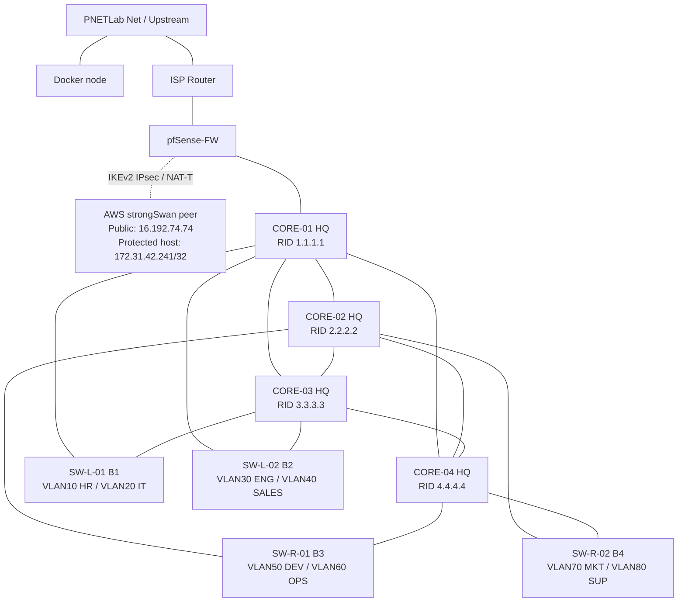
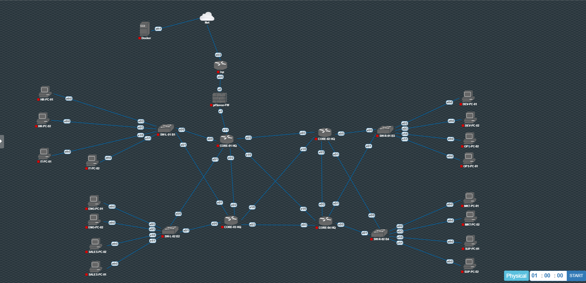

# Network Architecture

## Overview

The lab models an enterprise network in PNETLab with four Layer-3 core nodes, four access switches, eight departmental VLANs, an ISP edge, pfSense, and a cloud IPsec peer.

The first four VLANs (10–40) are currently the networks explicitly routed by pfSense and included in the supplied IPsec Phase 2 selectors. VLANs 50–80 are present in the wider PNETLab campus topology and are learned across the core through OSPF, but they are **not shown as pfSense IPsec selectors in the supplied screenshots**.

## Logical architecture

## Access groups visible in the PNETLab topology

| Access block | Department | VLAN | Client labels |
|---|---|---:|---|
| B1 | HR | 10 | HR-PC-01, HR-PC-02 |
| B1 | IT | 20 | IT-PC-01, IT-PC-02 |
| B2 | Engineering | 30 | ENG-PC-01, ENG-PC-02 |
| B2 | Sales | 40 | SALES-PC-01, SALES-PC-02 |
| B3 | Development | 50 | DEV-PC-01, DEV-PC-02 |
| B3 | Operations | 60 | OPS-PC-01, OPS-PC-02 |
| B4 | Marketing | 70 | MKT-PC-01, MKT-PC-02 |
| B4 | Support | 80 | SUP-PC-01, SUP-PC-02 |

## Primary evidence

