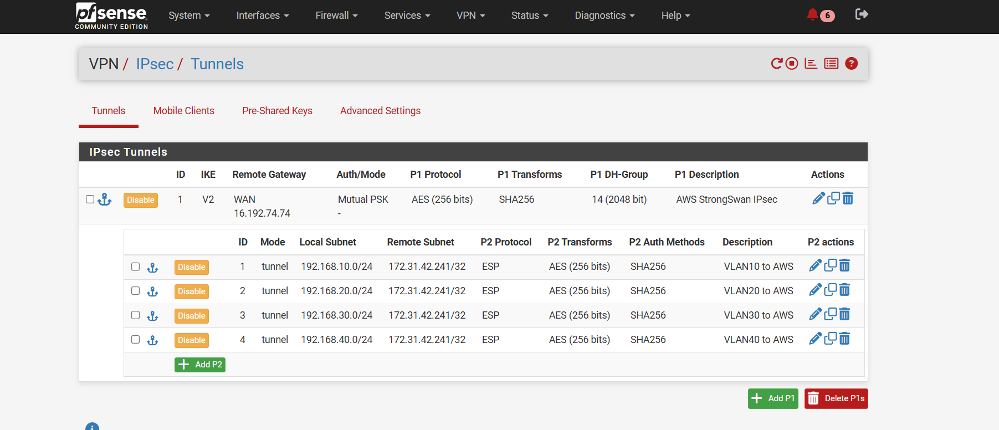
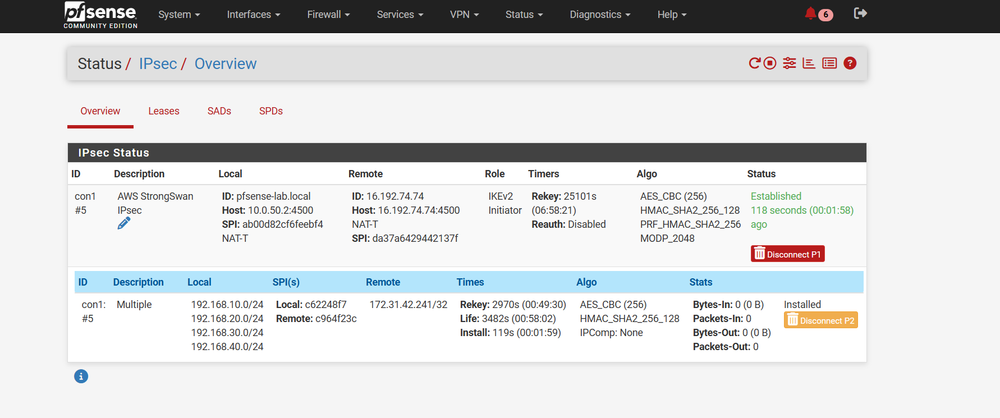

# pfSense ↔ AWS IPsec

## Phase 1

The supplied pfSense tunnel screenshot shows:

| Setting | Value |
|---|---|
| IKE version | IKEv2 |
| Remote gateway | `16.192.74.74` |
| Authentication | Mutual PSK |
| Encryption | AES 256-bit |
| Integrity / hash | SHA256 |
| DH group | 14 (2048-bit) |
| Description | AWS StrongSwan IPsec |

## Phase 2

Four tunnel-mode ESP selectors are configured:

| Local subnet | Remote subnet | Encryption | Integrity |
|---|---|---|---|
| `192.168.10.0/24` | `172.31.42.241/32` | AES-256 | SHA256 |
| `192.168.20.0/24` | `172.31.42.241/32` | AES-256 | SHA256 |
| `192.168.30.0/24` | `172.31.42.241/32` | AES-256 | SHA256 |
| `192.168.40.0/24` | `172.31.42.241/32` | AES-256 | SHA256 |

## Observed status

The supplied status screenshot confirms:

- IKE SA: **Established**
- Role: **Initiator**
- NAT-T: active
- Local endpoint: `10.0.50.2:4500`
- Remote endpoint: `16.192.74.74:4500`
- CHILD SA: **Installed**
- All four local traffic selectors are listed in the installed child SA.

At the instant of the supplied status screenshot, the CHILD SA counters show:

- `Packets-In: 0`
- `Packets-Out: 0`
- `Bytes-In: 0`
- `Bytes-Out: 0`

Therefore this evidence proves the IPsec **control plane is established**, but the screenshot itself does **not** prove successful end-to-end data-plane traffic. A final ping/traffic verification screenshot should be added later when available.

## Firewall rules

The supplied IPsec firewall screenshot shows explicit inbound rules from `172.31.42.241` to each local VLAN (10–40).

## Evidence

