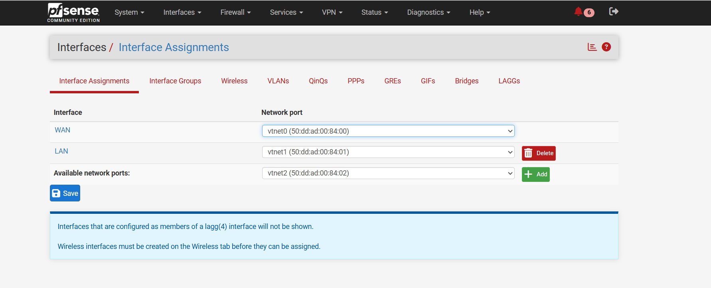
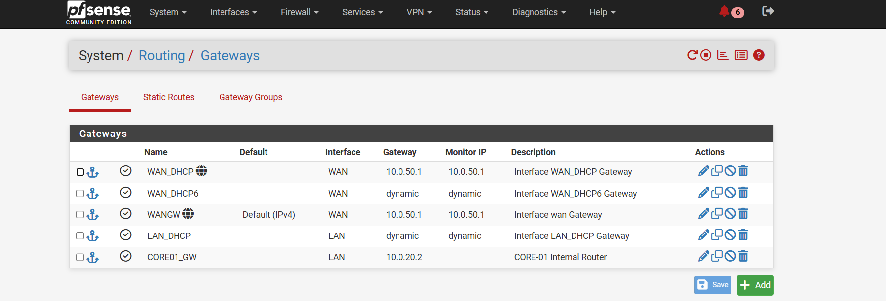
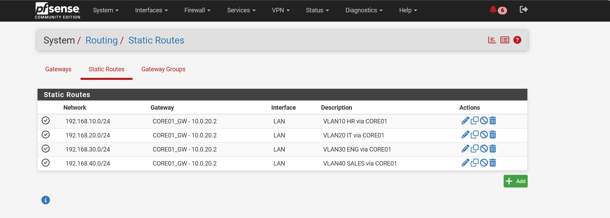
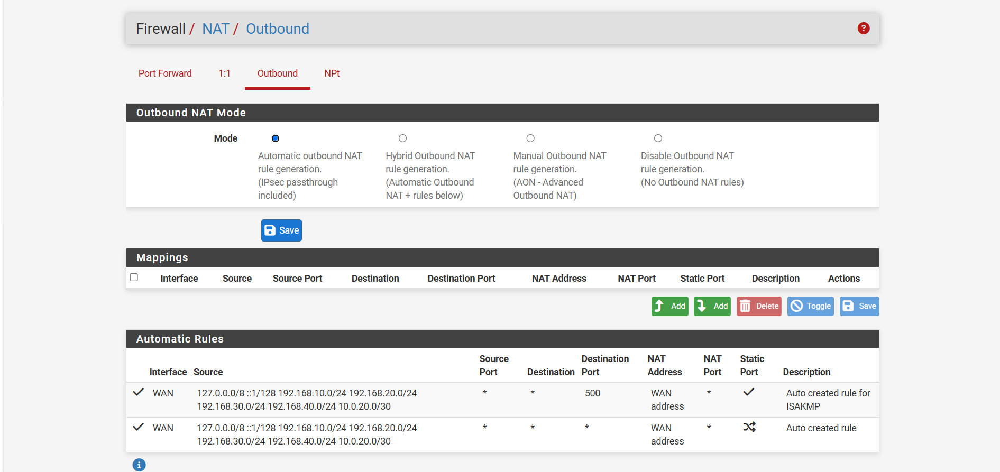
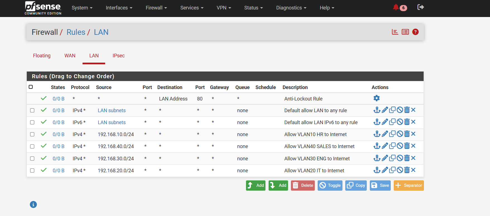
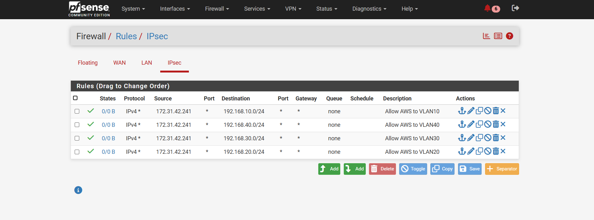

# Screenshot Evidence Index

All screenshots below were supplied for the network documentation package.

## 1. Full PNETLab topology

## 2. pfSense interface assignments

## 3. pfSense gateways

## 4. pfSense static routes

## 5. pfSense automatic outbound NAT

## 6. pfSense LAN firewall rules

## 7. pfSense IPsec firewall rules

## 8. pfSense IPsec tunnel definitions

## 9. pfSense IPsec established status

